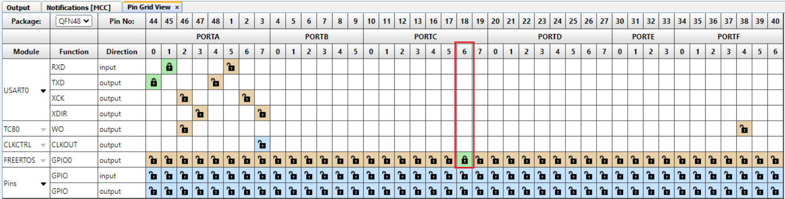

# Tickless Example Using AVR® DA Microcontroller and FreeRTOS™

The tickless project is a basic example that shows how to use a low-power functionality in a FreeRTOS project (Tickless mode) using the using the MPLAB® Code Configurator library.. The MCC Melody generated project offers a seamless integration of the FreeRTOS kernel files and port files, by providing a basic project structure that can be used as a starting point for an RTOS application.

The project is contained in a single source file (`freertos_interface.c`) as following:

1. The main application loop creates a semaphore, a queue and two tasks, then starts the RTOS scheduler.
2. The Queue Send Task is implemented by **prvQueueSendTask()**. It enters a blocked state in which it waits for the semaphore or for a set time to elapse (500 ms in this demo case) in order to send a fixed value (100 in this demo case) to the queue.
3. The Queue Receive Task is implemented by **prvQueueReceiveTask()**. It waits for a value to be received and if it matches the expected one, it toggles the LED for a set amount of time (30 ms in this demo case).

In Low Power Tickless Mode the RTOS tick is stopped, meaning that an intended delay for a task could not be attempted using the **vTaskDelay()** RTOS function that is based on the tick interrupt. For this example, the solution to obtain the delay needed for the Send Task is to use a semaphore that has a maximum block time of 500 ticks. The semaphore is never released, so the task will be blocked while trying to acquire the semaphore for the maximum time of 500 ticks. The tick rate for this demo is set to 1 ms, resulting in a 500 ms blocking time.

## Related Documentation

More details and code examples on the AVR128DA48 can be found at the following links:

- [AVR128DA48 Product Page](https://www.microchip.com/wwwproducts/en/AVR128DA48?utm_source=GitHub&utm_medium=TextLink&utm_campaign=MCU8_AVR-DA&utm_content=avr128da48-freertos-tickless-mplab-mcc-github&utm_bu=MCU08)
- [AVR128DA48 Code Examples on GitHub](https://github.com/microchip-pic-avr-examples?q=AVR128DA48)
- [FreeRTOS Demo for the Microchip AVR Dx Port](https://www.freertos.org/microchip-avr-dx-demo.html)
- [FreeRTOS pages](https://www.freertos.org/index.html)

## Software Used
- [MPLAB X IDE v6.20 or newer](https://www.microchip.com/en-us/tools-resources/develop/mplab-x-ide?utm_source=GitHub&utm_medium=TextLink&utm_campaign=MCU8_AVR-DA&utm_content=avr128da48-freertos-tickless-mplab-mcc-github&utm_bu=MCU08) 
- [MPLAB XC8 v2.46 or newer](https://www.microchip.com/en-us/tools-resources/develop/mplab-xc-compilers?utm_source=GitHub&utm_medium=TextLink&utm_campaign=MCU8_AVR-DA&utm_content=avr128da48-freertos-tickless-mplab-mcc-github&utm_bu=MCU08)
- [AVR-Dx Series Device Support v2.6.303 or newer](https://packs.download.microchip.com/)
- [MPLAB Code Configurator (MCC) v5.7.1 or newer](https://www.microchip.com/en-us/tools-resources/configure/mplab-code-configurator?utm_source=GitHub&utm_medium=TextLink&utm_campaign=MCU8_AVR-DA&utm_content=avr128da48-freertos-tickless-mplab-mcc-github&utm_bu=MCU08)

## MCC Configuration

- AVR Device package v4.11.0 or newer
- FreeRTOS Library v2.0.1

## Hardware Used

- The [AVR128DA48 Curiosity Nano Evaluation Kit](https://www.microchip.com/en-us/development-tool/dm164151?utm_source=GitHub&utm_medium=TextLink&utm_campaign=MCU8_AVR-DA&utm_content=avr128da48-freertos-tickless-mplab-mcc-github&utm_bu=MCU08) is used as a test platform
     

## Operation

To program the Curiosity Nano board with this MPLAB X project, follow the steps provided in the [How to Program the Curiosity Nano Board](#how-to-program-the-curiosity-nano-board) section. 

## Setup

The following configurations must be made for this project:

1. Add the FreeRTOS library to the project.
 

2. Configure the FreeRTOS application:  
    2.1 Select timer instance used as Tick Timer (TCB0 in this example).  
    2.2 Configure the desired Tick Rate.   
    2.3 Enable the Low Power Tickless Mode.  
    2.4 Update the FreeRTOS configuration using the UI.  
        
    2.5 Enable GPIO pins used by the FreeRTOS application (GPIO0).  
        
    2.6 Select the corresponding pin used as GPIO0 by the FreeRTOS application (PC6, Curiosity NANO on-board LED0).  
        

3. Generate the code using MCC Melody.

4. Add the demo application code in the `freertos_interface.c` file.

5. For information about the programming the device, see the Operation section in this document.

| Pin |     Configuration     |
| :-: | :-------------------: |
| PC6 | Digital Output (LED0) |

## Demo

The application queues blocks of 500 ms during which the LED stays on for 30 ms.
 

The result can also be seen by watching the signal with the logic analyzer:
 

The advantage of using the Low Power Tickless Mode is the low current consumption in idle state. For this example the current is measured using a [Power Debugger](https://www.microchip.com/en-us/development-tool/ATPOWERDEBUGGER?utm_source=GitHub&utm_medium=TextLink&utm_campaign=MCU8_AVR-DA&utm_content=avr128da48-freertos-tickless-mplab-mcc-github&utm_bu=MCU08) and is visualized in [MPLAB Data Visualizer](https://www.microchip.com/en-us/tools-resources/debug/mplab-data-visualizer?utm_source=GitHub&utm_medium=TextLink&utm_campaign=MCU8_AVR-DA&utm_content=avr128da48-freertos-tickless-mplab-mcc-github&utm_bu=MCU08). The results are shown in the below images:
- Low Power Tickless Mode enabled
 

- Low Power Tickless Mode disabled
 

## Summary

This repository provides an MPLAB X project that shows how to use the FreeRTOS library to create a basic demo application that toggles an LED using the Tickless mode on AVR128DA48 microcontroller.

## How to Program the Curiosity Nano Board

This chapter shows how to use the MPLAB X IDE to program an AVR device with an `Example_Project.X`. This can be applied to any other projects.

- Connect the board to the PC

- Open the `Example_Project.X` project in MPLAB X IDE

- Set the `Example_Project.X` project as main project

  - Right click the project in the **Projects** tab and click **Set as Main Project**
     

- Clean and build the `Example_Project.X` project

  - Right click the `Example_Project.X` project and select **Clean and Build**
     

- Select **AVRxxxxx Curiosity Nano** in the Connected Hardware Tool section of the project settings:

  - Right click the project and click **Properties**
  - Click the arrow under the Connected Hardware Tool
  - Select the **AVRxxxxx Curiosity Nano** (click the **SN**), click **Apply** and then **OK**:
     

- Program the project to the board
  - Right click the project and then **Make and Program Device**
     

 

## Contents

- [Back to Top](#tickless-example-using-avr®-da-microcontroller-and-freertos™)
- [Back to Related Documentation](#related-documentation)
- [Back to Software Used](#software-used)
- [Back to MCC Configuration](#mcc-configuration)
- [Back to Hardware Used](#hardware-used)
- [Back to Operation](#operation)
- [Back to Setup](#setup)
- [Back to Demo](#demo)
- [Back to Summary](#summary)
- [Back to How to Program the Curiosity Nano Board](#how-to-program-the-curiosity-nano-board)